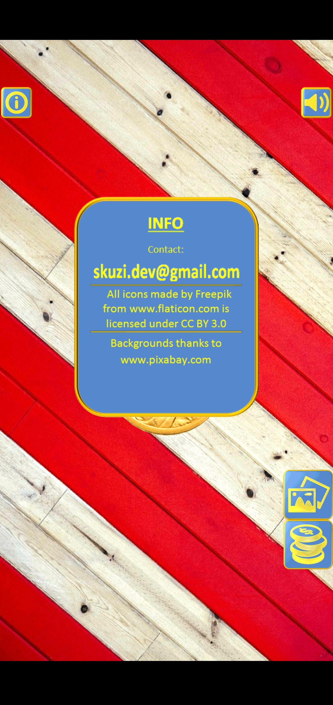
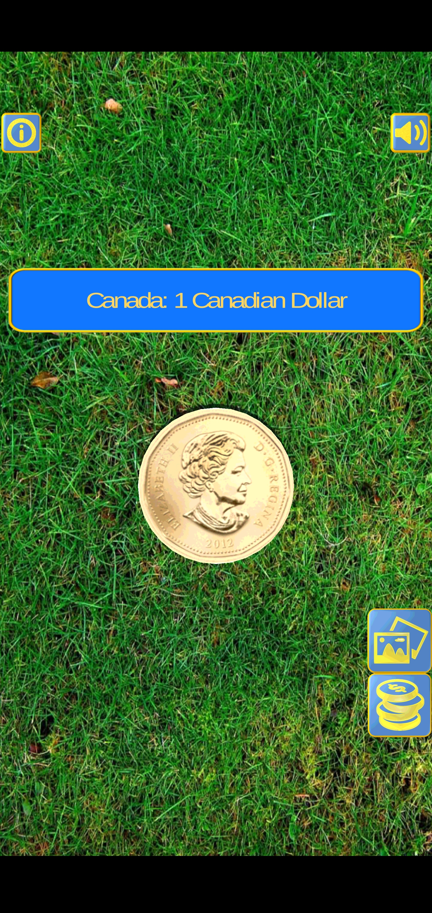
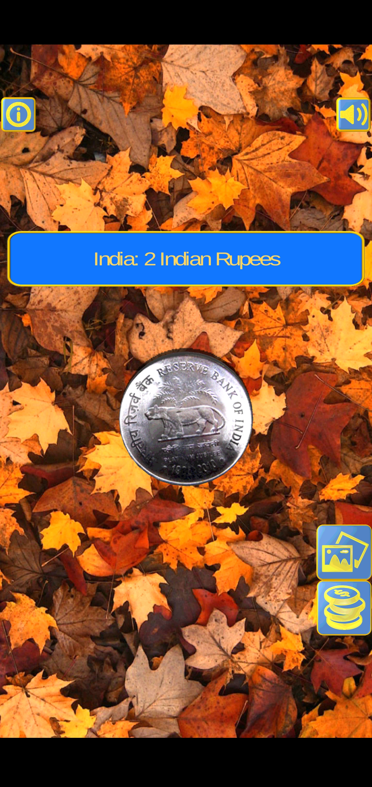

# CoinFlip
Coin flip android app made in Unity. Written in C#. 

**Phone Screenshots:**

 
 

_______________________

## Setup & Installation
- Install coinFlip.apk file on any Android phone, tablet, or emulator. Version 4.0+
- Use Unity(https://unity.com/products/unity-platform) to manage and edit files. 
- Install:
  ```bash
    Install coinFlip.apk
  ```

## Usage
+ Press the icon for CoinFlip in your app library.
+ App starts on the US 1 Dollar coin.
+ Press anywhere on the screen to randomly flip the coin.
+ Buttons: Info toggle, Sound toggle, Background switch, Coin switch.

## Status
- **CURRENT STATUS:** Base app is complete. Possible updates in the future.

**Implemented:**
- Countries: Australia, Canada, China, Hong Kong, India, Israel, Mexico, Nepal, Netherlands, Norway, Russia, Singapore, South Korea, Sweden, Taiwan

**Future Updates:**
- Add more coins.
- Allow user to pick coin from a gui list.
- Fix any errors.
- Add more backgrounds.
- Allow user to pick background from a gui list.

## Contributions
- Developer: Santosh Khadka        skhadka.code@gmail.com, skuzi.dev@gmail.com

- All icons made by Freepik from www.flaticon.com - images edited by Santosh Khadka.
- Background images thanks to www.pixabay.com

